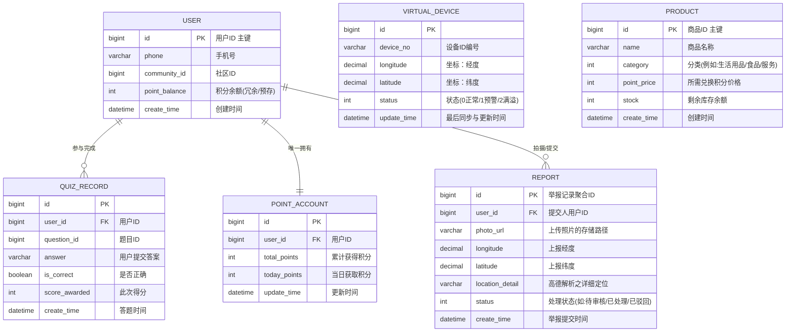

# 数据库 E-R 图与建模设计

## 1. 核心实体关系图 (E-R Diagram)

以下是系统核心实体的 ER 关系模型，清晰描述了用户、答题记录、积分、设备、商品和违规举报等实体之间的业务与关联关系。

## 2. 字段与存储策略说明

1. **用户表 (`user`)**：
   - 包含用户的登录凭证和状态。`point_balance` 是当前积分余额的核心字段，变更时必须结合事物或乐观锁以防并发问题影响数据一致性。

2. **答题记录表 (`quiz_record`)**：
   - 对于 `answer` 和 `is_correct` 进行留存以便追溯每日的打卡行为。

3. **积分账户表 (`point_account`)**：
   - 作为用户积分流水和宏观限制的汇总，利用 `today_points` 用于限制每日最多可获得积分的规则判断。

4. **虚拟设备表 (`virtual_device`)**：
   - `longitude` / `latitude` 应用 Decimal 或 Double 数据格式精准存储基于高德地图的经纬度，`status` 设计为枚举 Int 提升查询效率。

5. **商品表 (`product`)**：
   - 当商城发生并发兑换时，`stock` 将搭配 Redis 使用 Lua 脚本进行预扣减并落库保障一致性。

6. **举报记录表 (`report`)**：
   - 对于 `photo_url`，存储 OSS 地址或容器化服务的相对文件路径挂载；`status` 流转需配合相应的后端服务流完成闭环。
